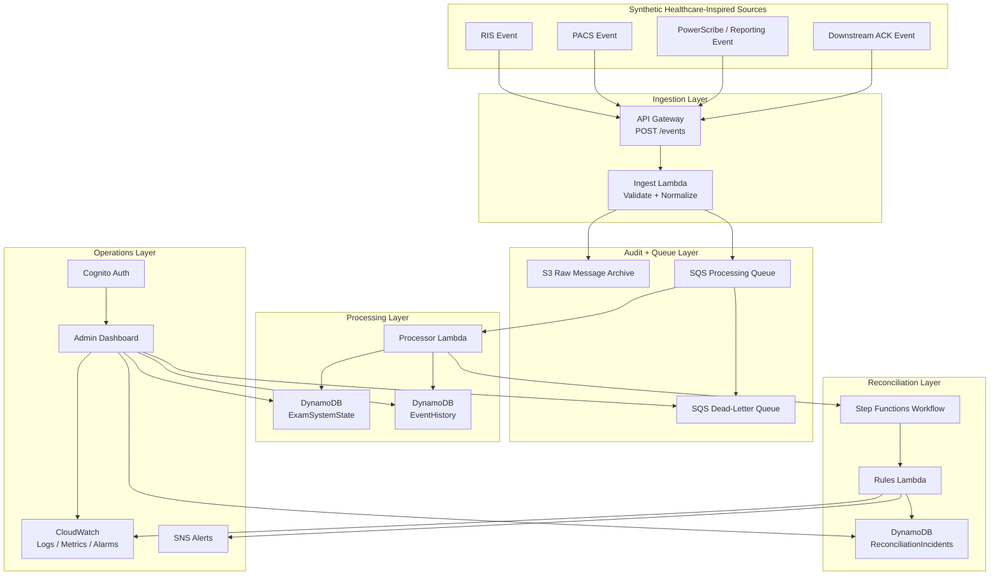
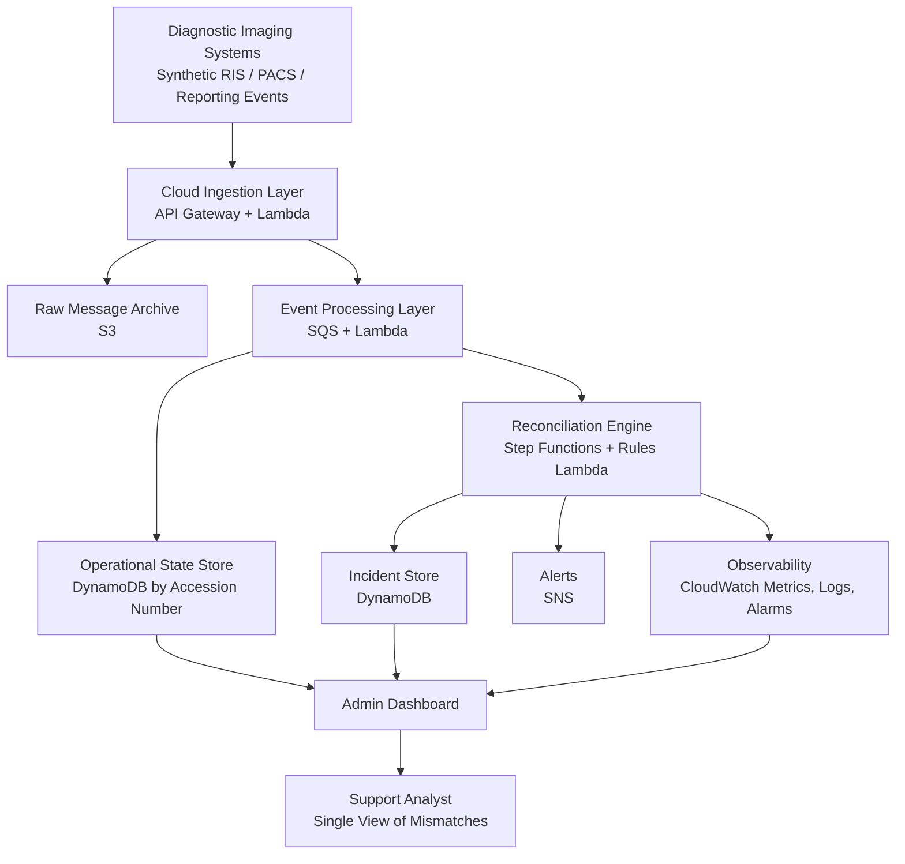
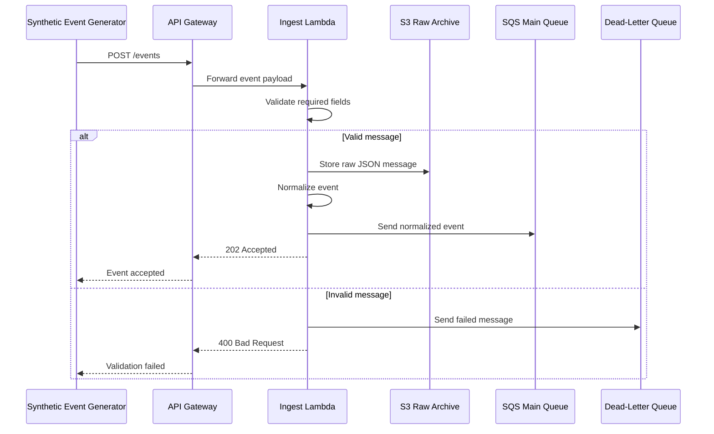
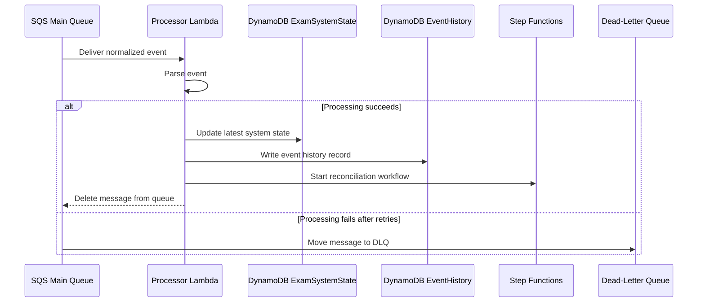
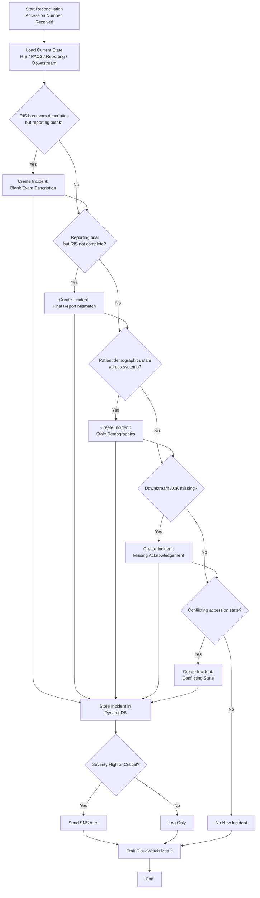
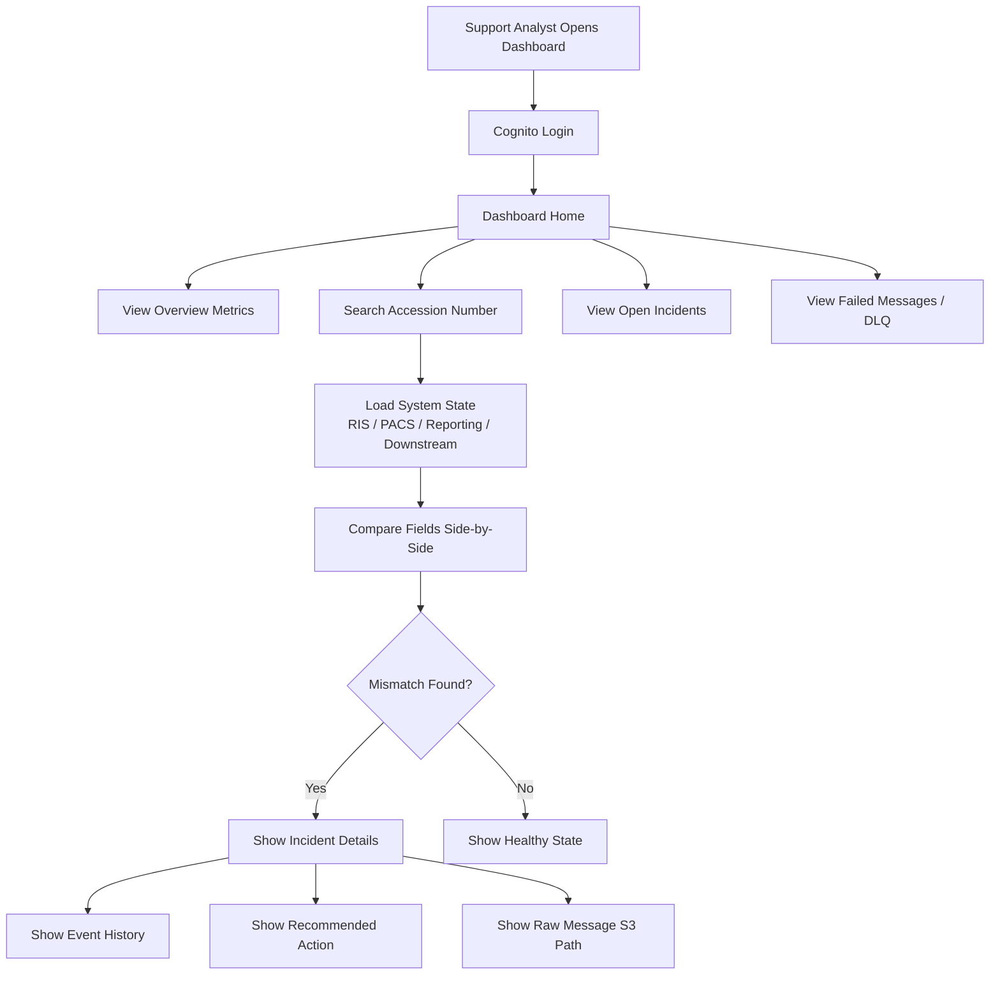
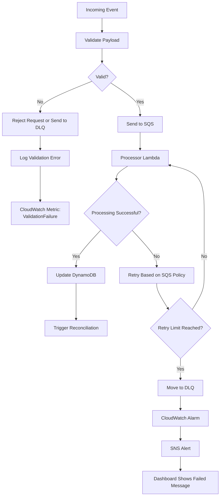

# Architecture

## Main README Architecture Diagram

## Executive Architecture Diagram

## Event Ingestion Flow

## Message Processing Flow

## Reconciliation Workflow

## Dashboard User Flow

## Failure Handling Flow

