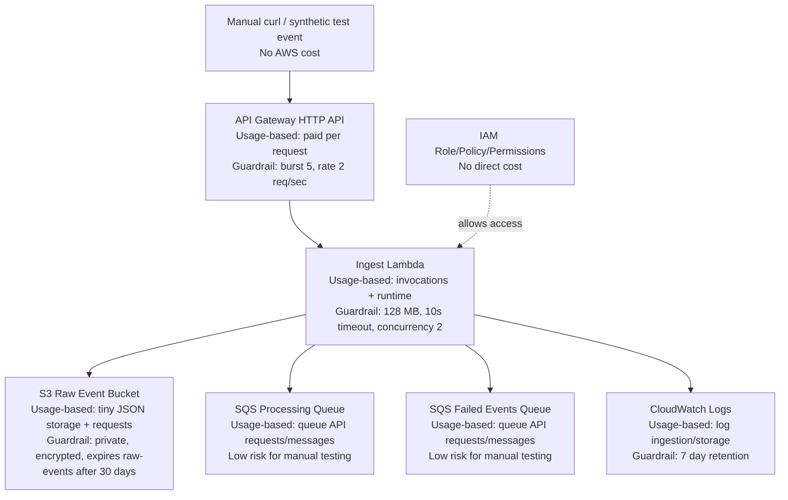

# Phase 3 Cost Guardrails

## Purpose

This document explains which Phase 3 AWS resources are free to define, which can create usage-based cost, and which guardrails are in place before deployment.

Phase 3 is designed for cautious manual testing only. It does not create EC2, RDS, NAT Gateway, load balancers, EKS, OpenSearch, DynamoDB, Step Functions, Cognito, or a dashboard.

## Cost-Oriented Architecture



## Free Or No Direct Cost

These do not normally cost money just by existing:

- IAM role
- IAM inline policy
- Lambda permission for API Gateway
- API Gateway route/integration definitions
- S3 public access block configuration
- S3 encryption configuration
- S3 lifecycle configuration
- Terraform files and local state

## Usage-Based Cost

These can cost money when used:

| Resource | What Creates Cost | Current Guardrail |
|---|---|---|
| API Gateway HTTP API | Incoming HTTP requests | Default stage throttled to burst `5`, rate `2` requests/sec |
| Lambda | Invocations, runtime, memory | `128 MB`, `10s` timeout, reserved concurrency `2` |
| S3 raw archive | Object storage and requests | Private bucket, raw events expire after `30` days |
| SQS queues | Queue API requests and retained messages | Standard queues, small test messages only |
| CloudWatch Logs | Log ingestion and storage | Log retention `7` days |

## What The Guardrails Mean

### API Gateway Throttling

Terraform sets:

```text
api_throttle_burst_limit = 5
api_throttle_rate_limit  = 2
```

This means the API is not intended to accept high request volume. Manual testing with a few `curl` commands is fine.

### Lambda Reserved Concurrency

Terraform sets:

```text
ingest_lambda_reserved_concurrency = 2
```

This caps the ingest Lambda to two concurrent executions. If something accidentally sends many requests, Lambda cannot scale this function without limit.

### Log Retention

Terraform sets:

```text
log_retention_days = 7
```

CloudWatch logs are automatically expired after seven days.

### S3 Lifecycle

Terraform sets:

```text
raw_event_retention_days = 30
```

Raw sample event objects under `raw-events/` expire after thirty days.

## Main Remaining Risk

The Phase 3 API endpoint has no authentication yet:

```text
authorization_type = "NONE"
```

That is acceptable for a short local learning test, but do not post the endpoint publicly. The throttling and Lambda concurrency cap reduce risk if the endpoint is accidentally called too much.

Authentication is intentionally deferred because Cognito/dashboard protection is a later phase.

## Clean Up

When testing is done, remove all Phase 3 AWS resources:

```bash
terraform -chdir=infra/phase3 destroy
```

This is the strongest cost control. If the resources are destroyed, they cannot keep receiving requests or storing new logs/messages.

